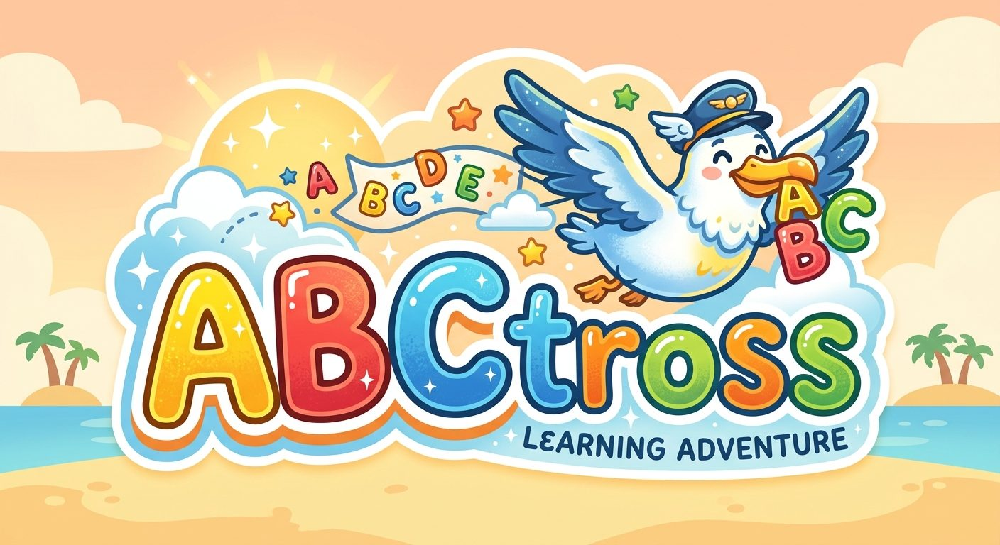
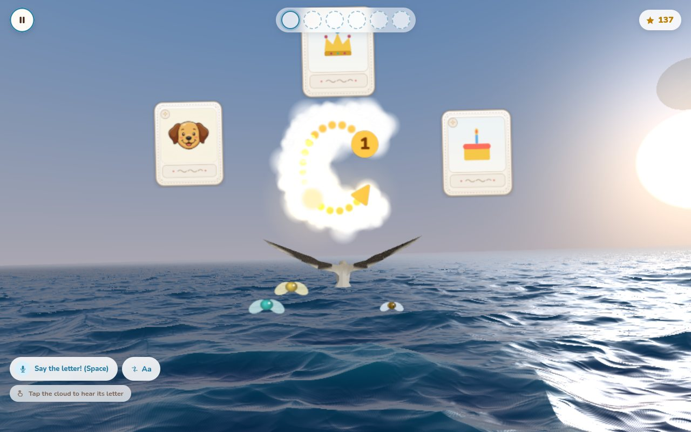
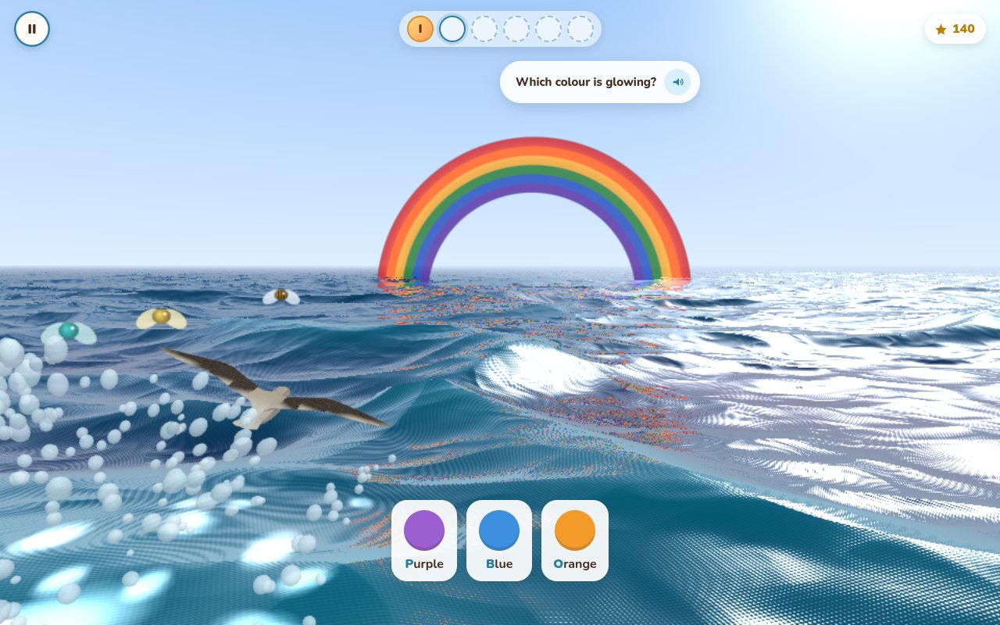
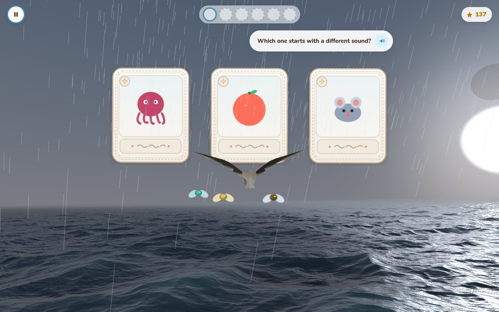
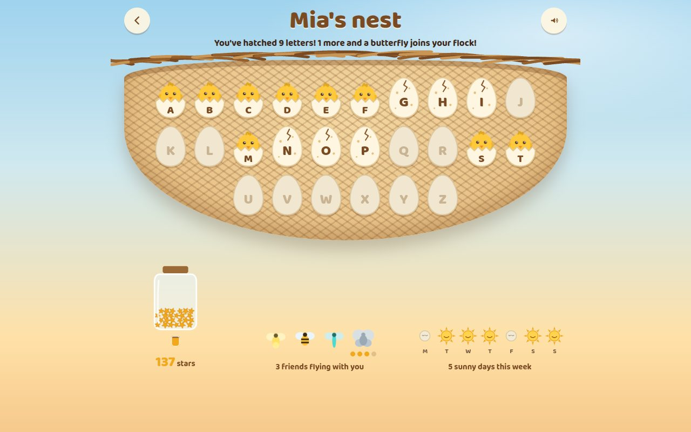
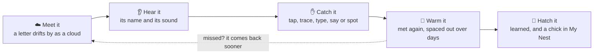
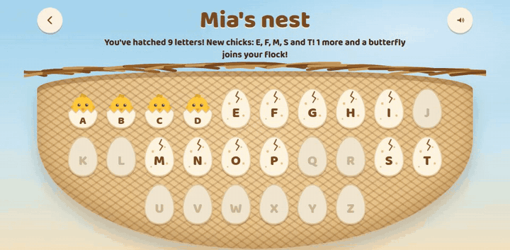
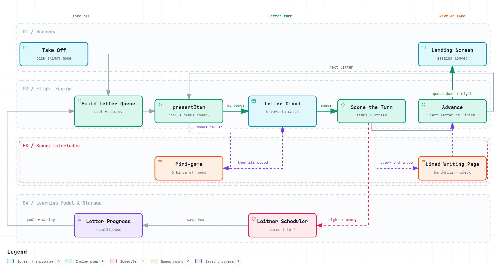

<p align="center">
  
</p>

# ABCtross

An alphabet and early-reading game for young children, built around a
wandering albatross. The child flies over an open sea from morning into night, letters drift
by as clouds, and catching them (by tapping, tracing, typing, saying, or
spotting a picture) teaches each letter's shape, name and sound. Designed
for a 4–6 year old learning English as a second language, grounded in
early-literacy research (see [`docs/02-pedagogy.md`](docs/02-pedagogy.md)).

<table>
  <tr>
    <td width="50%"></td>
    <td width="50%"></td>
  </tr>
  <tr>
    <td><b>Catch the letter.</b> Tap, trace, type or say it, or spot the picture that starts with it.</td>
    <td><b>Rainbow bonus.</b> Which colour is glowing? Get it right and the albatross dashes through the arch.</td>
  </tr>
  <tr>
    <td></td>
    <td></td>
  </tr>
  <tr>
    <td><b>Storm round.</b> Which one starts with a different sound? Pick it and the rain stops.</td>
    <td><b>My Nest.</b> Every letter is an egg that hatches once it's learned.</td>
  </tr>
</table>

## How a letter is learned



Letters come back on a spaced-repetition schedule: often while they're
new or shaky, less and less once they're known. The order and the teaching
choices follow early-literacy research: letter sounds before names,
pictures paired with words, and tracing to build letter shapes.

## What's in the game

- **Four ways to fly.** Classic, Endless, Sprint, and **My Name**, where
  the child flies the letters of their own name and hears it spelled at
  the end.
- **Letter sounds and names.** Every letter can be heard by its name
  ("bee"), its sound ("buh"), or both. Word rounds blend sounds into words.
- **Bonus rounds that teach reading:**
  - hear-the-letter plane choice,
  - look-alike letters (b/d),
  - catch-the-letters word spelling,
  - the rainbow,
  - the storm's odd-one-out sounds,
  - **Storm Vowels** (C _ T: find the missing vowel).
- **Tracing and writing.** Stroke-by-stroke tracing on the letter clouds, a
  lined writing page, and an optional webcam check of letters written on
  real paper.
- **Grown-ups dashboard.** Progress per letter, flight length, letter-voice
  setting, focus letters to practise, and more, behind a press-and-hold
  button.

### My Nest

<p align="center">
  
</p>

The child's own progress report. Letters learned since the last visit hatch
in front of them, and the nest says what's new out loud. There's a star
jar, a flock of companions that grows as letters are learned, and a week
of suns. It only ever shows growth.

Everything runs locally in the browser. There's no account or server, and
progress is saved on the device.

## How it works

<picture>
  <source media="(prefers-color-scheme: dark)" srcset="docs/images/game-engine-dark.png" />
  
</picture>

- **One letter at a time.** Take off builds a short queue of letters from
  the child's current pool. Each letter goes through a single function,
  `presentItem`, which decides whether a bonus round plays first. The
  letter's own cloud always follows, so no letter is ever skipped.
- **Catching and scoring.** A cloud can be caught five ways (tap, trace,
  type, say, or spot the picture). The answer earns stars and streaks, and
  every third traced letter opens a lined writing page.
- **Remembering.** Every right or wrong answer moves the letter between
  Leitner boxes 0 to 4, saved in the browser. That decides how soon each
  letter comes back, and which letters the next flight is built from.
- **The world.** The sea and sky are a single raymarched shader, and the
  albatross, clouds and cards are three.js objects (via React Three Fiber)
  drawn over it. The rainbow and the storm are drawn inside the shader, so
  they reflect in the water.

For an interactive version with guided walkthroughs, download
[`docs/diagrams/game-engine.html`](docs/diagrams/game-engine.html) and open
it in a browser. The full design notes are in [`docs/`](docs/README.md).

## Porting to another language

The game is built for English, and there is no translation layer yet: the
language lives in data files, a few engine modules, the recorded audio,
and the text in the screens. Porting it means working through the list
below. Languages with a Latin alphabet (Spanish, French, German and so on)
are mostly a content job. A different script (Hebrew, Arabic, Cyrillic,
Greek) touches more of the code, noted at the end.

**1. The alphabet and its order**

- `app/src/data/curriculum.ts` builds the teaching order as A to Z.
  Replace it with the new alphabet, in a sensible teaching order (see
  `docs/02-pedagogy.md`).
- Several places assume the 26 letters A to Z, such as the
  `/^[A-Z]$/` checks in `engine/audio.ts` and the letter keys in saved
  progress. Search for `A-Z` and `fromCharCode(65` and widen them. Saves
  from the English game won't carry over.

**2. Letter names and sounds**

- `engine/letterNameMatch.ts`:
  - `LETTER_SPOKEN_NAME` is how each letter's name is spelled for the
    voice ("Bee", "Aitch").
  - `LETTER_NAME_ALIASES` lists what a speech recogniser may write when a
    child says that name ("bee", "be"). Both need the new language's names.
- `data/letterSounds.ts`: each letter's sound, spelled out ("buh",
  "mmmm"). Pick the sound a beginner reader needs; in many languages
  that's simpler than in English.

**3. Words and pictures**

- These are the words shown, spoken and blended:
  - `data/words.ts`,
  - `data/flashcards.ts`,
  - `data/cvcWords.ts` (short consonant-vowel-consonant words for the
    blending and Storm Vowels rounds).
- A picture's first letter changes with the language (Cat becomes *Gato*,
  *Chat*, *Katze*), so each card has to move to its new letter. Some
  letters will need new pictures.
- `data/initialSounds.ts` records each word's first *sound*, which the
  storm round compares. It is checked by hand and must be redone for the
  new words. The rule in `CLAUDE.md` applies: sounds, not letters.
- Check the card art in `app/public/` for printed English text.

**4. Voice and listening**

- **Recorded clips:** in `app/public/audio/{letters,sounds,words}/`.
  Regenerate them with `assets/generate-audio.mjs`. It reads the word and
  letter lists straight from the files above. Update its voice
  instruction for the new language, and pick a Gemini voice that speaks
  it well.
- **Fallback voice:** `engine/audio.ts` falls back to the browser's
  speech voice. It only accepts English voices (`lang` starting with `en`)
  from a list of English voice names. Change the language check, and
  replace the list with good voices for the new language.
- **Speech recognition:** `engine/speech.ts` listens with `en-US`. Pass
  the new language's code, and update `engine/wordMatch.ts`, which
  checks the first letter of a spoken word.

**5. Screen text**

The kid-facing and grown-up screens have their text written directly in
the components (`app/src/screens/`, `app/src/three/FlightGameScreen.tsx`
and others), including the lines the game says aloud. Translate them in
place, or, for more than one language, first move them into one strings
file per language.

**6. Other scripts (Hebrew, Arabic, Cyrillic, Greek)**

- **Letter shapes:** `data/letterStrokes.ts` holds the stroke-by-stroke
  tracing paths. It is generated by
  `app/scripts/generate-letter-strokes.mjs`, which needs new letterforms.
- **Handwriting check:** the webcam check uses a model trained on Latin
  letters (EMNIST). It needs a model for the new script, or it should be
  turned off.
- **Fonts:** Baloo 2 and Nunito cover Latin only. Choose fonts that cover
  the new script.
- **Right-to-left:** Hebrew and Arabic also need right-to-left layout.
  The My Name spelling and the word rounds would then run from right to
  left.

**Checking a port.** Run the checks in `CLAUDE.md` in the new language:
- Generate thousands of rounds against the new word lists.
- Listen to every clip.
- Play a full flight at each letter-voice setting.

## Running it

```bash
cd app
npm install
npm run dev      # HTTPS dev server (camera and microphone features need HTTPS)
npm run build    # type-check and production build
npm run lint
```

[`docs/10-flight-game.md`](docs/10-flight-game.md) is the detailed log of
how the flight game works and why.

## TBD

- **Webcam letter check that works on mobile.** The check of letters
  written on real paper doesn't work on mobile devices today. It needs a
  working recognition setup there: camera capture, the recognition model
  and its performance on a phone or tablet.
- **Better voice.** Anything without a recorded clip still falls back to
  the browser's built-in speech synthesis, whose quality depends on the
  device. Replace it with one of these:
  - recorded clips for *everything* the game says, including every
    spoken line, not just letters and words;
  - a better speech engine.

## License

**Copyright © 2026 Idan Ben-Zvi. All rights reserved.**

This is proprietary software. No one may use, copy, modify, distribute, or
create derivative works of this game or any part of it without my prior
written permission. The code being publicly visible does not grant any
rights to it. See [`LICENSE`](LICENSE) for the full terms. To ask for
permission, contact me through [my GitHub profile](https://github.com/idanbenzvi).

## Third-party notices

These parts belong to others and remain under their own licenses. The
proprietary license above does not apply to them:

- **Albatross photograph** (`app/public/art/albatross-photo.jpg`):
  [JJ Harrison](https://commons.wikimedia.org/wiki/File:Diomedea_exulans_-_SE_Tasmania.jpg),
  [CC BY-SA 3.0](https://creativecommons.org/licenses/by-sa/3.0/).
- **Fonts:** Baloo 2 and Nunito, loaded from Google Fonts under the
  [SIL Open Font License](https://openfontlicense.org).
- **Open-source libraries** installed through npm (React, three.js, React
  Three Fiber, drei, TensorFlow.js and others), each under its own license
  as listed in its package.
