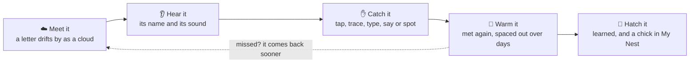

<p align="center">
  
</p>

# ABCtross

An alphabet and early-reading game for young children, built around a
wandering albatross. The child flies over an open sea from morning into night, letters drift
by as clouds, and catching them (by tapping, tracing, typing, saying, or
spotting a picture) teaches each letter's shape, name and sound. Designed
for a 4–6 year old learning English as a second language, grounded in
early-literacy research (see [`docs/02-pedagogy.md`](docs/02-pedagogy.md)).

<table>
  <tr>
    <td width="50%"></td>
    <td width="50%"></td>
  </tr>
  <tr>
    <td><b>Catch the letter.</b> Tap, trace, type or say it, or spot the picture that starts with it.</td>
    <td><b>Rainbow bonus.</b> Which colour is glowing? Get it right and the albatross dashes through the arch.</td>
  </tr>
  <tr>
    <td></td>
    <td></td>
  </tr>
  <tr>
    <td><b>Storm round.</b> Which one starts with a different sound? Pick it and the rain stops.</td>
    <td><b>My Nest.</b> Every letter is an egg that hatches once it's learned.</td>
  </tr>
</table>

## How a letter is learned



Letters come back on a spaced-repetition schedule: often while they're
new or shaky, less and less once they're known. The order and the teaching
choices follow early-literacy research: letter sounds before names,
pictures paired with words, and tracing to build letter shapes.

## What's in the game

- **Four ways to fly.** Classic, Endless, Sprint, and **My Name**, where
  the child flies the letters of their own name and hears it spelled at
  the end.
- **Letter sounds and names.** Every letter can be heard by its name
  ("bee"), its sound ("buh"), or both. Word rounds blend sounds into words.
- **Bonus rounds that teach reading:**
  - hear-the-letter plane choice,
  - look-alike letters (b/d),
  - catch-the-letters word spelling,
  - the rainbow,
  - the storm's odd-one-out sounds,
  - **Storm Vowels** (C _ T: find the missing vowel).
- **Tracing and writing.** Stroke-by-stroke tracing on the letter clouds, a
  lined writing page, and an optional webcam check of letters written on
  real paper.
- **Grown-ups dashboard.** Progress per letter, flight length, letter-voice
  setting, focus letters to practise, and more, behind a press-and-hold
  button.

### My Nest

<p align="center">
  
</p>

The child's own progress report. Letters learned since the last visit hatch
in front of them, and the nest says what's new out loud. There's a star
jar, a flock of companions that grows as letters are learned, and a week
of suns. It only ever shows growth.

Everything runs locally in the browser. There's no account or server, and
progress is saved on the device.

## Running it

```bash
cd app
npm install
npm run dev      # HTTPS dev server (camera and microphone features need HTTPS)
npm run build    # type-check and production build
npm run lint
```

The design and engineering notes live in [`docs/`](docs/README.md).
[`docs/10-flight-game.md`](docs/10-flight-game.md) is the detailed log of
how the flight game works and why.

## License

**Copyright © 2026 Idan Ben-Zvi. All rights reserved.**

This is proprietary software. No one may use, copy, modify, distribute, or
create derivative works of this game or any part of it without my prior
written permission. The code being publicly visible does not grant any
rights to it. See [`LICENSE`](LICENSE) for the full terms. To ask for
permission, contact me through [my GitHub profile](https://github.com/idanbenzvi).

## Third-party notices

These parts belong to others and remain under their own licenses. The
proprietary license above does not apply to them:

- **Ocean and sky shader** (`app/src/three/oceanSky.ts`): adapted from
  ["Oceanara"](https://codepen.io/Julibe/pen/GgjjpeB) by Julibe, whose core
  is ["Seascape"](https://www.shadertoy.com/view/Ms2SD1) by Alexander
  Alekseev (TDM), licensed
  [CC BY-NC-SA 3.0](https://creativecommons.org/licenses/by-nc-sa/3.0/).
- **Albatross photograph** (`app/public/art/albatross-photo.jpg`):
  [JJ Harrison](https://commons.wikimedia.org/wiki/File:Diomedea_exulans_-_SE_Tasmania.jpg),
  [CC BY-SA 3.0](https://creativecommons.org/licenses/by-sa/3.0/).
- **Fonts:** Baloo 2 and Nunito, loaded from Google Fonts under the
  [SIL Open Font License](https://openfontlicense.org).
- **Open-source libraries** installed through npm (React, three.js, React
  Three Fiber, drei, TensorFlow.js and others), each under its own license
  as listed in its package.
